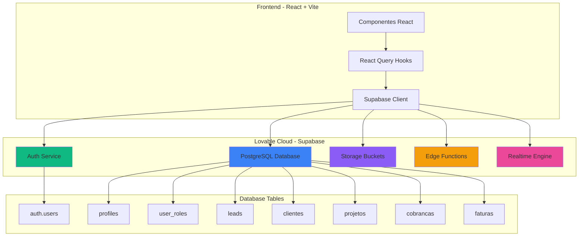
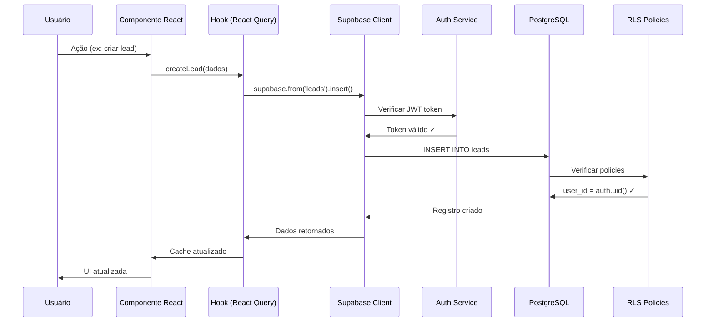

# 🚀 ROADMAP DE MIGRAÇÃO PARA SUPABASE

## 📋 Sumário

- [Introdução e Contexto](#introdução-e-contexto)
- [Visão Geral da Arquitetura](#visão-geral-da-arquitetura)
- [Roadmap Detalhado](#roadmap-detalhado)
  - [FASE 1: Setup Inicial (30 min)](#fase-1-setup-inicial-30-min)
  - [FASE 2: Schema do Banco de Dados (1h)](#fase-2-schema-do-banco-de-dados-1h)
  - [FASE 3: Row Level Security - RLS (1h)](#fase-3-row-level-security---rls-1h)
  - [FASE 4: Autenticação Supabase (30 min)](#fase-4-autenticação-supabase-30-min)
  - [FASE 5: Migração de Dados (1h)](#fase-5-migração-de-dados-1h)
  - [FASE 6: Funcionalidades Avançadas (1h)](#fase-6-funcionalidades-avançadas-1h)
  - [FASE 7: Seed Data Inicial (30 min)](#fase-7-seed-data-inicial-30-min)
  - [FASE 8: Testes e Validação (1h)](#fase-8-testes-e-validação-1h)
- [Código SQL Completo](#código-sql-completo)
- [Código TypeScript/React](#código-typescriptreact)
- [Checklist de Implementação](#checklist-de-implementação)
- [Troubleshooting](#troubleshooting)
- [Próximos Passos](#próximos-passos)

---

## Introdução e Contexto

### 📊 Sistema Atual vs Sistema Proposto

| Aspecto | Sistema Atual | Sistema Proposto |
|---------|---------------|------------------|
| **Armazenamento** | localStorage (navegador) | PostgreSQL (Supabase) |
| **Autenticação** | Mock/fake (sem segurança) | Supabase Auth (JWT + RLS) |
| **Segurança** | ❌ Nenhuma | ✅ Row Level Security + Policies |
| **Persistência** | ❌ Perdida ao limpar cache | ✅ Permanente |
| **Multi-usuário** | ❌ Não suportado | ✅ Multi-tenant completo |
| **Escalabilidade** | ❌ Limitado a 5-10MB | ✅ Ilimitado |
| **Backup** | ❌ Manual/inexistente | ✅ Automático |
| **Auditoria** | ❌ Não rastreável | ✅ Logs completos |
| **Hierarquia** | ❌ Não existe | ✅ Admin > Gestor > Vendedor |
| **Realtime** | ❌ Não | ✅ Opcional (Websockets) |

### 🎯 Benefícios da Migração

1. **Segurança Real**: Autenticação JWT + políticas RLS impedem acesso não autorizado
2. **Multi-tenant**: Cada vendedor vê apenas seus dados, gestores veem o time, admins veem tudo
3. **Escalabilidade**: De 10 a 1.000.000 de registros sem mudanças na arquitetura
4. **Auditoria**: Rastreamento completo de todas as ações (quem, quando, o quê)
5. **Performance**: Queries otimizadas no PostgreSQL > operações em memória do JavaScript
6. **Colaboração**: Múltiplos usuários simultâneos sem conflitos
7. **Backup Automático**: Supabase faz backups diários automaticamente
8. **API Pronta**: RESTful + GraphQL geradas automaticamente

### ⚠️ Pré-requisitos Técnicos

- ✅ Projeto Lovable ativo
- ✅ Node.js 18+ e npm instalados (se desenvolvimento local)
- ✅ Conhecimento básico de SQL e React
- ✅ Entendimento de autenticação JWT (recomendado)

---

## Visão Geral da Arquitetura

### 🏗️ Arquitetura Proposta



### 📦 Stack Tecnológico

**Frontend:**
- React 18.3+ com TypeScript
- Vite (build tool)
- TanStack Query (React Query) para cache e mutations
- Supabase JS Client para comunicação com backend

**Backend (Lovable Cloud):**
- PostgreSQL 15+ (database)
- PostgREST (API automática)
- GoTrue (autenticação)
- Realtime (websockets - opcional)
- Deno (edge functions)

**Segurança:**
- Row Level Security (RLS) nativo do PostgreSQL
- JWT tokens com refresh automático
- Políticas baseadas em roles (admin/gestor/vendedor)

### 🔄 Fluxo de Dados



---

## Roadmap Detalhado

### FASE 1: Setup Inicial (30 min)

#### 1.1 Habilitar Lovable Cloud

**Ação:** Clicar no botão de integração Supabase no Lovable

**O que acontece automaticamente:**
- ✅ Provisionamento de projeto Supabase
- ✅ Criação de variáveis de ambiente (`VITE_SUPABASE_URL`, `VITE_SUPABASE_PUBLISHABLE_KEY`)
- ✅ Configuração de autenticação básica

**Verificação:**
```bash
# No terminal do projeto, verificar se as variáveis existem
echo $VITE_SUPABASE_URL
echo $VITE_SUPABASE_PUBLISHABLE_KEY
```

#### 1.2 Estrutura de Diretórios

Criar a seguinte estrutura no projeto:

```
projeto-moreira/
├── supabase/
│   ├── migrations/
│   │   ├── 001_initial_schema.sql       # Tabelas principais
│   │   ├── 002_auth_setup.sql           # Sistema de roles
│   │   ├── 003_rls_policies.sql         # Políticas de segurança
│   │   ├── 004_functions.sql            # Database functions
│   │   └── 005_seed_data.sql            # Dados iniciais
│   └── functions/                        # Edge functions (futuro)
├── src/
│   ├── integrations/
│   │   └── supabase/
│   │       ├── client.ts                # Cliente Supabase configurado
│   │       └── types.ts                 # Tipos TypeScript do DB
│   ├── hooks/
│   │   ├── useLeads.ts                  # CRUD de leads
│   │   ├── useClientes.ts               # CRUD de clientes
│   │   ├── useProjetos.ts               # CRUD de projetos
│   │   ├── useCobrancas.ts              # CRUD de cobranças
│   │   ├── useGestaoFaturas.ts          # CRUD de faturas
│   │   └── useAuth.ts                   # Autenticação
│   └── ...
```

**Comando para criar diretórios:**
```bash
mkdir -p supabase/migrations supabase/functions
mkdir -p src/integrations/supabase
```

#### 1.3 Configurar Cliente Supabase

Criar arquivo `src/integrations/supabase/client.ts`:

```typescript
import { createClient } from '@supabase/supabase-js';

const supabaseUrl = import.meta.env.VITE_SUPABASE_URL!;
const supabaseAnonKey = import.meta.env.VITE_SUPABASE_PUBLISHABLE_KEY!;

if (!supabaseUrl || !supabaseAnonKey) {
  throw new Error('Missing Supabase environment variables');
}

export const supabase = createClient(supabaseUrl, supabaseAnonKey, {
  auth: {
    persistSession: true,
    autoRefreshToken: true,
    detectSessionInUrl: true,
  },
});
```

---

### FASE 2: Schema do Banco de Dados (1h)

#### 2.1 Tabelas Principais (15 tabelas)

##### 2.1.1 Sistema de Autenticação e Roles

**Arquivo:** `supabase/migrations/002_auth_setup.sql`

```sql
-- =====================================================
-- SISTEMA DE AUTENTICAÇÃO E ROLES
-- =====================================================

-- Enum de perfis de usuário
CREATE TYPE app_role AS ENUM ('admin', 'gestor', 'vendedor');

-- Tabela de perfis (vinculada ao auth.users do Supabase)
CREATE TABLE profiles (
  id UUID PRIMARY KEY REFERENCES auth.users(id) ON DELETE CASCADE,
  nome TEXT NOT NULL,
  avatar TEXT,
  telefone TEXT,
  cargo TEXT,
  created_at TIMESTAMPTZ DEFAULT NOW(),
  updated_at TIMESTAMPTZ DEFAULT NOW()
);

-- Comentários para documentação
COMMENT ON TABLE profiles IS 'Perfis de usuários com dados complementares';
COMMENT ON COLUMN profiles.id IS 'UUID do usuário no auth.users';
COMMENT ON COLUMN profiles.nome IS 'Nome completo do usuário';

-- Tabela de roles (CRÍTICO: separada para evitar privilege escalation)
CREATE TABLE user_roles (
  id UUID PRIMARY KEY DEFAULT gen_random_uuid(),
  user_id UUID REFERENCES auth.users(id) ON DELETE CASCADE NOT NULL,
  role app_role NOT NULL,
  gestor_id UUID REFERENCES auth.users(id), -- Para hierarquia (vendedor -> gestor)
  created_at TIMESTAMPTZ DEFAULT NOW(),
  updated_at TIMESTAMPTZ DEFAULT NOW(),
  UNIQUE(user_id, role)
);

COMMENT ON TABLE user_roles IS 'Roles de usuários - NUNCA armazenar no profiles!';
COMMENT ON COLUMN user_roles.gestor_id IS 'ID do gestor responsável (para hierarquia)';

-- Índices para performance
CREATE INDEX idx_user_roles_user_id ON user_roles(user_id);
CREATE INDEX idx_user_roles_gestor_id ON user_roles(gestor_id);
CREATE INDEX idx_user_roles_role ON user_roles(role);

-- Tabela de permissões granulares por módulo
CREATE TABLE permissions (
  id UUID PRIMARY KEY DEFAULT gen_random_uuid(),
  user_id UUID REFERENCES auth.users(id) ON DELETE CASCADE NOT NULL,
  modulo TEXT NOT NULL, -- 'leads', 'clientes', 'projetos', 'cobrancas', 'faturas', etc
  criar BOOLEAN DEFAULT false,
  editar BOOLEAN DEFAULT false,
  excluir BOOLEAN DEFAULT false,
  visualizar BOOLEAN DEFAULT false,
  created_at TIMESTAMPTZ DEFAULT NOW(),
  updated_at TIMESTAMPTZ DEFAULT NOW(),
  UNIQUE(user_id, modulo)
);

COMMENT ON TABLE permissions IS 'Permissões CRUD por módulo e usuário';

-- Índice para busca rápida de permissões
CREATE INDEX idx_permissions_user_modulo ON permissions(user_id, modulo);

-- =====================================================
-- TRIGGER: Criar profile automaticamente ao criar usuário
-- =====================================================

CREATE OR REPLACE FUNCTION handle_new_user()
RETURNS TRIGGER
LANGUAGE plpgsql
SECURITY DEFINER SET search_path = public
AS $$
BEGIN
  -- Cria profile com dados do metadata
  INSERT INTO public.profiles (id, nome, telefone)
  VALUES (
    NEW.id,
    COALESCE(NEW.raw_user_meta_data->>'nome', 'Novo Usuário'),
    COALESCE(NEW.raw_user_meta_data->>'telefone', NULL)
  );
  
  -- Atribui role padrão 'vendedor' se não especificado
  INSERT INTO public.user_roles (user_id, role)
  VALUES (
    NEW.id,
    COALESCE((NEW.raw_user_meta_data->>'role')::app_role, 'vendedor')
  );
  
  RETURN NEW;
END;
$$;

CREATE TRIGGER on_auth_user_created
  AFTER INSERT ON auth.users
  FOR EACH ROW EXECUTE FUNCTION handle_new_user();

COMMENT ON FUNCTION handle_new_user IS 'Cria profile e role padrão automaticamente';
```

##### 2.1.2 Módulo CRM

**Arquivo:** `supabase/migrations/001_initial_schema.sql`

```sql
-- =====================================================
-- MÓDULO CRM - LEADS E CLIENTES
-- =====================================================

-- Tabela de Leads
CREATE TABLE leads (
  id UUID PRIMARY KEY DEFAULT gen_random_uuid(),
  user_id UUID REFERENCES auth.users(id) ON DELETE CASCADE NOT NULL,
  nome TEXT NOT NULL,
  telefone TEXT NOT NULL,
  email TEXT,
  cidade TEXT,
  uf CHAR(2),
  fonte TEXT, -- 'Instagram', 'Facebook', 'Indicação', 'Google', etc
  status TEXT DEFAULT 'Novo', -- 'Novo', 'Contatado', 'Qualificado', 'Perdido', 'Convertido'
  observacoes TEXT,
  vendedor_id UUID REFERENCES auth.users(id), -- Vendedor responsável
  created_at TIMESTAMPTZ DEFAULT NOW(),
  updated_at TIMESTAMPTZ DEFAULT NOW()
);

COMMENT ON TABLE leads IS 'Leads do funil de vendas';
COMMENT ON COLUMN leads.user_id IS 'Usuário que criou o lead (para RLS)';
COMMENT ON COLUMN leads.vendedor_id IS 'Vendedor responsável pelo lead';

-- Índices para filtros comuns
CREATE INDEX idx_leads_user_id ON leads(user_id);
CREATE INDEX idx_leads_vendedor_id ON leads(vendedor_id);
CREATE INDEX idx_leads_status ON leads(status);
CREATE INDEX idx_leads_created_at ON leads(created_at DESC);

-- Tabela de Clientes
CREATE TABLE clientes (
  id UUID PRIMARY KEY DEFAULT gen_random_uuid(),
  user_id UUID REFERENCES auth.users(id) ON DELETE CASCADE NOT NULL,
  nome TEXT NOT NULL,
  cpf_cnpj TEXT,
  telefone TEXT NOT NULL,
  email TEXT,
  endereco JSONB, -- {rua, numero, complemento, bairro, cep, cidade, estado}
  dados_complementares JSONB, -- {profissao, renda_mensal, estado_civil, data_nascimento}
  vendedor_id UUID REFERENCES auth.users(id),
  lead_origem_id UUID REFERENCES leads(id), -- Lead que originou o cliente
  created_at TIMESTAMPTZ DEFAULT NOW(),
  updated_at TIMESTAMPTZ DEFAULT NOW()
);

COMMENT ON TABLE clientes IS 'Clientes convertidos';
COMMENT ON COLUMN clientes.endereco IS 'Endereço completo em formato JSON';
COMMENT ON COLUMN clientes.lead_origem_id IS 'Lead que originou este cliente (rastreabilidade)';

-- Índices
CREATE INDEX idx_clientes_user_id ON clientes(user_id);
CREATE INDEX idx_clientes_vendedor_id ON clientes(vendedor_id);
CREATE INDEX idx_clientes_cpf_cnpj ON clientes(cpf_cnpj);
CREATE INDEX idx_clientes_lead_origem ON clientes(lead_origem_id);
```

##### 2.1.3 Módulos Financeiros

```sql
-- =====================================================
-- MÓDULOS FINANCEIROS - ORÇAMENTOS, PROJETOS, COBRANÇAS
-- =====================================================

-- Tabela de Orçamentos
CREATE TABLE orcamentos (
  id UUID PRIMARY KEY DEFAULT gen_random_uuid(),
  user_id UUID REFERENCES auth.users(id) ON DELETE CASCADE NOT NULL,
  cliente_id UUID REFERENCES clientes(id) ON DELETE CASCADE,
  titulo TEXT NOT NULL,
  valor_total DECIMAL(12,2) NOT NULL,
  status TEXT DEFAULT 'Rascunho', -- 'Rascunho', 'Enviado', 'Aprovado', 'Recusado', 'Expirado'
  validade DATE,
  dados_tecnicos JSONB, -- Toda a simulação (potência, módulos, inversor, economia, etc)
  observacoes TEXT,
  created_at TIMESTAMPTZ DEFAULT NOW(),
  updated_at TIMESTAMPTZ DEFAULT NOW()
);

COMMENT ON TABLE orcamentos IS 'Orçamentos e propostas comerciais';
COMMENT ON COLUMN orcamentos.dados_tecnicos IS 'Simulação completa do sistema solar em JSON';

-- Índices
CREATE INDEX idx_orcamentos_user_id ON orcamentos(user_id);
CREATE INDEX idx_orcamentos_cliente_id ON orcamentos(cliente_id);
CREATE INDEX idx_orcamentos_status ON orcamentos(status);

-- Tabela de Projetos
CREATE TABLE projetos (
  id UUID PRIMARY KEY DEFAULT gen_random_uuid(),
  user_id UUID REFERENCES auth.users(id) ON DELETE CASCADE NOT NULL,
  cliente_id UUID REFERENCES clientes(id) ON DELETE CASCADE,
  orcamento_id UUID REFERENCES orcamentos(id),
  titulo TEXT NOT NULL,
  descricao TEXT,
  status TEXT DEFAULT 'Planejamento', -- 'Planejamento', 'Em Andamento', 'Concluído', 'Cancelado'
  fase TEXT, -- 'Documentação', 'Homologação', 'Instalação', 'Comissionamento', 'Finalizado'
  valor DECIMAL(12,2),
  data_inicio DATE,
  data_conclusao_prevista DATE,
  data_conclusao_real DATE,
  dados JSONB, -- Informações técnicas do projeto
  created_at TIMESTAMPTZ DEFAULT NOW(),
  updated_at TIMESTAMPTZ DEFAULT NOW()
);

COMMENT ON TABLE projetos IS 'Projetos de instalação solar';

-- Índices
CREATE INDEX idx_projetos_user_id ON projetos(user_id);
CREATE INDEX idx_projetos_cliente_id ON projetos(cliente_id);
CREATE INDEX idx_projetos_orcamento_id ON projetos(orcamento_id);
CREATE INDEX idx_projetos_status ON projetos(status);

-- Tabela de Cobranças
CREATE TABLE cobrancas (
  id UUID PRIMARY KEY DEFAULT gen_random_uuid(),
  user_id UUID REFERENCES auth.users(id) ON DELETE CASCADE NOT NULL,
  cliente_id UUID REFERENCES clientes(id) ON DELETE CASCADE,
  unidade_consumidora_id UUID REFERENCES unidades_consumidoras(id), -- Para GC
  valor DECIMAL(12,2) NOT NULL,
  vencimento DATE NOT NULL,
  data_pagamento DATE,
  status TEXT DEFAULT 'Pendente', -- 'Pendente', 'Pago', 'Atrasado', 'Cancelado', 'Pendente Aprovação'
  tipo TEXT, -- 'Financiamento' ou 'GC'
  descricao TEXT,
  dados_gc JSONB, -- {energiaRecebida, descontoGC, mesReferencia}
  observacoes TEXT,
  created_at TIMESTAMPTZ DEFAULT NOW(),
  updated_at TIMESTAMPTZ DEFAULT NOW()
);

COMMENT ON TABLE cobrancas IS 'Cobranças de financiamento e geração compartilhada';
COMMENT ON COLUMN cobrancas.dados_gc IS 'Dados específicos de geração compartilhada';

-- Índices
CREATE INDEX idx_cobrancas_user_id ON cobrancas(user_id);
CREATE INDEX idx_cobrancas_cliente_id ON cobrancas(cliente_id);
CREATE INDEX idx_cobrancas_status ON cobrancas(status);
CREATE INDEX idx_cobrancas_vencimento ON cobrancas(vencimento);
CREATE INDEX idx_cobrancas_tipo ON cobrancas(tipo);
```

##### 2.1.4 Gestão de Faturas

```sql
-- =====================================================
-- GESTÃO DE FATURAS - ENERGIA E COMPENSAÇÃO
-- =====================================================

-- Tabela de Titulares de Energia
CREATE TABLE titulares_energia (
  id UUID PRIMARY KEY DEFAULT gen_random_uuid(),
  user_id UUID REFERENCES auth.users(id) ON DELETE CASCADE NOT NULL,
  nome TEXT NOT NULL,
  cpf_cnpj TEXT NOT NULL UNIQUE,
  tipo TEXT NOT NULL CHECK (tipo IN ('PF', 'PJ')),
  concessionaria TEXT NOT NULL, -- 'Energisa', 'CEMIG', 'CPFL', etc
  telefone TEXT,
  email TEXT,
  dados_acesso JSONB, -- {usuario, senha_criptografada} - NUNCA em plain text!
  ultimo_acesso TIMESTAMPTZ,
  created_at TIMESTAMPTZ DEFAULT NOW(),
  updated_at TIMESTAMPTZ DEFAULT NOW()
);

COMMENT ON TABLE titulares_energia IS 'Titulares de contas de energia elétrica';
COMMENT ON COLUMN titulares_energia.dados_acesso IS 'Credenciais criptografadas (NUNCA plain text!)';

-- Índices
CREATE INDEX idx_titulares_user_id ON titulares_energia(user_id);
CREATE INDEX idx_titulares_cpf_cnpj ON titulares_energia(cpf_cnpj);

-- Tabela de Unidades Consumidoras
CREATE TABLE unidades_consumidoras (
  id UUID PRIMARY KEY DEFAULT gen_random_uuid(),
  user_id UUID REFERENCES auth.users(id) ON DELETE CASCADE NOT NULL,
  cliente_id UUID REFERENCES clientes(id),
  titular_id UUID REFERENCES titulares_energia(id) NOT NULL,
  numero_uc TEXT NOT NULL UNIQUE,
  apelido TEXT,
  tipo TEXT NOT NULL CHECK (tipo IN ('UGF', 'UGI', 'UCB ACR', 'UCB Assoc', 'Convencional')),
  endereco JSONB,
  status TEXT DEFAULT 'Ativa' CHECK (status IN ('Ativa', 'Inativa', 'Suspensa')),
  dados_faturamento JSONB, -- {mediaConsumo, mediaCusto, historicoMensal}
  created_at TIMESTAMPTZ DEFAULT NOW(),
  updated_at TIMESTAMPTZ DEFAULT NOW()
);

COMMENT ON TABLE unidades_consumidoras IS 'Unidades consumidoras de energia';
COMMENT ON COLUMN unidades_consumidoras.tipo IS 'UGF=Minigeração, UGI=Microgeração, UCB=Beneficiária';
COMMENT ON COLUMN unidades_consumidoras.numero_uc IS 'Número único da UC na concessionária';

-- Índices
CREATE INDEX idx_unidades_user_id ON unidades_consumidoras(user_id);
CREATE INDEX idx_unidades_cliente_id ON unidades_consumidoras(cliente_id);
CREATE INDEX idx_unidades_titular_id ON unidades_consumidoras(titular_id);
CREATE INDEX idx_unidades_numero_uc ON unidades_consumidoras(numero_uc);
CREATE INDEX idx_unidades_tipo ON unidades_consumidoras(tipo);

-- Tabela de Vínculos de Compensação
CREATE TABLE vinculos_compensacao (
  id UUID PRIMARY KEY DEFAULT gen_random_uuid(),
  user_id UUID REFERENCES auth.users(id) ON DELETE CASCADE NOT NULL,
  ugi_id UUID REFERENCES unidades_consumidoras(id) ON DELETE CASCADE NOT NULL,
  ucb_id UUID REFERENCES unidades_consumidoras(id) ON DELETE CASCADE NOT NULL,
  modelo TEXT NOT NULL CHECK (modelo IN ('ACR', 'Associação')),
  percentual DECIMAL(5,2) NOT NULL CHECK (percentual BETWEEN 0 AND 100),
  ativo BOOLEAN DEFAULT true,
  data_inicio DATE,
  data_fim DATE,
  created_at TIMESTAMPTZ DEFAULT NOW(),
  updated_at TIMESTAMPTZ DEFAULT NOW(),
  UNIQUE(ugi_id, ucb_id),
  CHECK (ugi_id != ucb_id) -- Evitar auto-vínculo
);

COMMENT ON TABLE vinculos_compensacao IS 'Vínculos de compensação entre UGI e UCB';
COMMENT ON COLUMN vinculos_compensacao.modelo IS 'ACR=Autoconsumo Remoto, Associação=EMUC';
COMMENT ON COLUMN vinculos_compensacao.percentual IS 'Percentual de compensação (0-100%)';

-- Índices
CREATE INDEX idx_vinculos_ugi ON vinculos_compensacao(ugi_id);
CREATE INDEX idx_vinculos_ucb ON vinculos_compensacao(ucb_id);
CREATE INDEX idx_vinculos_ativo ON vinculos_compensacao(ativo);

-- Tabela de Faturas (PDFs e dados extraídos)
CREATE TABLE faturas (
  id UUID PRIMARY KEY DEFAULT gen_random_uuid(),
  user_id UUID REFERENCES auth.users(id) ON DELETE CASCADE NOT NULL,
  unidade_consumidora_id UUID REFERENCES unidades_consumidoras(id) ON DELETE CASCADE NOT NULL,
  mes_referencia DATE NOT NULL, -- Primeiro dia do mês (ex: 2025-01-01)
  consumo_kwh DECIMAL(10,2),
  injecao_kwh DECIMAL(10,2),
  creditos_gerados DECIMAL(10,2),
  creditos_utilizados DECIMAL(10,2),
  valor_total DECIMAL(10,2),
  pdf_url TEXT, -- Caminho no Supabase Storage (ex: 'faturas/2025-01/UC12345.pdf')
  dados_completos JSONB, -- Dados detalhados da fatura em JSON
  processado BOOLEAN DEFAULT false,
  created_at TIMESTAMPTZ DEFAULT NOW(),
  updated_at TIMESTAMPTZ DEFAULT NOW(),
  UNIQUE(unidade_consumidora_id, mes_referencia)
);

COMMENT ON TABLE faturas IS 'Faturas de energia (PDFs e dados extraídos)';
COMMENT ON COLUMN faturas.pdf_url IS 'Caminho do PDF no Supabase Storage';
COMMENT ON COLUMN faturas.dados_completos IS 'Dados detalhados em JSON (OCR/Parser)';

-- Índices
CREATE INDEX idx_faturas_user_id ON faturas(user_id);
CREATE INDEX idx_faturas_uc_id ON faturas(unidade_consumidora_id);
CREATE INDEX idx_faturas_mes_referencia ON faturas(mes_referencia DESC);
CREATE INDEX idx_faturas_processado ON faturas(processado);
```

##### 2.1.5 Auditoria e Logs

```sql
-- =====================================================
-- SISTEMA DE AUDITORIA
-- =====================================================

-- Tabela de logs de auditoria
CREATE TABLE audit_logs (
  id UUID PRIMARY KEY DEFAULT gen_random_uuid(),
  user_id UUID REFERENCES auth.users(id),
  tabela TEXT NOT NULL,
  registro_id UUID NOT NULL,
  acao TEXT NOT NULL CHECK (acao IN ('INSERT', 'UPDATE', 'DELETE')),
  dados_anteriores JSONB,
  dados_novos JSONB,
  ip_address INET,
  user_agent TEXT,
  created_at TIMESTAMPTZ DEFAULT NOW()
);

COMMENT ON TABLE audit_logs IS 'Logs de auditoria de todas as operações críticas';

-- Índices para consultas rápidas
CREATE INDEX idx_audit_logs_user_id ON audit_logs(user_id);
CREATE INDEX idx_audit_logs_tabela_registro ON audit_logs(tabela, registro_id);
CREATE INDEX idx_audit_logs_created_at ON audit_logs(created_at DESC);
CREATE INDEX idx_audit_logs_acao ON audit_logs(acao);

-- Função genérica para auditoria (pode ser usada em triggers)
CREATE OR REPLACE FUNCTION audit_trigger()
RETURNS TRIGGER
LANGUAGE plpgsql
SECURITY DEFINER
AS $$
BEGIN
  IF (TG_OP = 'DELETE') THEN
    INSERT INTO audit_logs (user_id, tabela, registro_id, acao, dados_anteriores)
    VALUES (auth.uid(), TG_TABLE_NAME, OLD.id, TG_OP, to_jsonb(OLD));
    RETURN OLD;
  ELSIF (TG_OP = 'UPDATE') THEN
    INSERT INTO audit_logs (user_id, tabela, registro_id, acao, dados_anteriores, dados_novos)
    VALUES (auth.uid(), TG_TABLE_NAME, NEW.id, TG_OP, to_jsonb(OLD), to_jsonb(NEW));
    RETURN NEW;
  ELSIF (TG_OP = 'INSERT') THEN
    INSERT INTO audit_logs (user_id, tabela, registro_id, acao, dados_novos)
    VALUES (auth.uid(), TG_TABLE_NAME, NEW.id, TG_OP, to_jsonb(NEW));
    RETURN NEW;
  END IF;
END;
$$;

-- Aplicar auditoria nas tabelas críticas (exemplo)
CREATE TRIGGER audit_cobrancas
  AFTER INSERT OR UPDATE OR DELETE ON cobrancas
  FOR EACH ROW EXECUTE FUNCTION audit_trigger();

CREATE TRIGGER audit_projetos
  AFTER INSERT OR UPDATE OR DELETE ON projetos
  FOR EACH ROW EXECUTE FUNCTION audit_trigger();

CREATE TRIGGER audit_user_roles
  AFTER INSERT OR UPDATE OR DELETE ON user_roles
  FOR EACH ROW EXECUTE FUNCTION audit_trigger();
```

---

### FASE 3: Row Level Security - RLS (1h)

#### 3.1 Funções Helper (Evitam recursão infinita)

**Arquivo:** `supabase/migrations/003_rls_policies.sql`

```sql
-- =====================================================
-- FUNÇÕES HELPER PARA RLS (SECURITY DEFINER)
-- =====================================================

-- Verifica se usuário tem determinada role
CREATE OR REPLACE FUNCTION has_role(_user_id UUID, _role app_role)
RETURNS BOOLEAN
LANGUAGE sql
STABLE
SECURITY DEFINER
SET search_path = public
AS $$
  SELECT EXISTS (
    SELECT 1
    FROM public.user_roles
    WHERE user_id = _user_id AND role = _role
  )
$$;

COMMENT ON FUNCTION has_role IS 'Verifica se usuário tem role específica (evita recursão RLS)';

-- Verifica se é gestor de um usuário
CREATE OR REPLACE FUNCTION is_gestor_of(_user_id UUID, _target_user_id UUID)
RETURNS BOOLEAN
LANGUAGE sql
STABLE
SECURITY DEFINER
SET search_path = public
AS $$
  SELECT EXISTS (
    SELECT 1
    FROM public.user_roles
    WHERE user_id = _target_user_id AND gestor_id = _user_id
  )
$$;

COMMENT ON FUNCTION is_gestor_of IS 'Verifica se _user_id é gestor de _target_user_id';

-- Verifica se usuário pode acessar dados de outro usuário (hierarquia)
CREATE OR REPLACE FUNCTION can_access_user_data(_user_id UUID, _target_user_id UUID)
RETURNS BOOLEAN
LANGUAGE sql
STABLE
SECURITY DEFINER
SET search_path = public
AS $$
  SELECT (
    _user_id = _target_user_id OR -- Próprios dados
    has_role(_user_id, 'admin') OR -- Admin vê tudo
    is_gestor_of(_user_id, _target_user_id) -- Gestor vê subordinados
  )
$$;

COMMENT ON FUNCTION can_access_user_data IS 'Verifica acesso hierárquico a dados de usuário';
```

#### 3.2 Policies por Tabela

##### Profiles (público para leitura, restrito para edição)

```sql
-- =====================================================
-- RLS: PROFILES
-- =====================================================

ALTER TABLE profiles ENABLE ROW LEVEL SECURITY;

-- SELECT: Todos podem ver perfis (para exibir nomes em listas)
CREATE POLICY "Profiles são visíveis para usuários autenticados"
  ON profiles FOR SELECT
  TO authenticated
  USING (true);

-- UPDATE: Apenas próprio usuário pode editar
CREATE POLICY "Usuários podem atualizar próprio perfil"
  ON profiles FOR UPDATE
  TO authenticated
  USING (auth.uid() = id)
  WITH CHECK (auth.uid() = id);

-- INSERT: Não permitir (apenas via trigger)
CREATE POLICY "Profiles criados apenas via trigger"
  ON profiles FOR INSERT
  TO authenticated
  WITH CHECK (false); -- Bloqueia INSERT manual

-- DELETE: Não permitir (cascade via auth.users)
CREATE POLICY "Profiles não podem ser deletados manualmente"
  ON profiles FOR DELETE
  TO authenticated
  USING (false);
```

##### User Roles (admin gerencia, demais apenas leem)

```sql
-- =====================================================
-- RLS: USER_ROLES (CRÍTICO PARA SEGURANÇA)
-- =====================================================

ALTER TABLE user_roles ENABLE ROW LEVEL SECURITY;

-- SELECT: Admins veem tudo, usuários veem próprias roles
CREATE POLICY "Admins e gestores veem roles"
  ON user_roles FOR SELECT
  TO authenticated
  USING (
    has_role(auth.uid(), 'admin') OR
    user_id = auth.uid() OR
    is_gestor_of(auth.uid(), user_id)
  );

-- INSERT: Apenas admins criam roles
CREATE POLICY "Apenas admins criam roles"
  ON user_roles FOR INSERT
  TO authenticated
  WITH CHECK (has_role(auth.uid(), 'admin'));

-- UPDATE: Apenas admins editam roles
CREATE POLICY "Apenas admins editam roles"
  ON user_roles FOR UPDATE
  TO authenticated
  USING (has_role(auth.uid(), 'admin'))
  WITH CHECK (has_role(auth.uid(), 'admin'));

-- DELETE: Apenas admins removem roles
CREATE POLICY "Apenas admins removem roles"
  ON user_roles FOR DELETE
  TO authenticated
  USING (has_role(auth.uid(), 'admin'));
```

##### Leads (multi-tenant com hierarquia)

```sql
-- =====================================================
-- RLS: LEADS
-- =====================================================

ALTER TABLE leads ENABLE ROW LEVEL SECURITY;

-- SELECT: Visibilidade por hierarquia
CREATE POLICY "Leads visibilidade por hierarquia"
  ON leads FOR SELECT
  TO authenticated
  USING (
    has_role(auth.uid(), 'admin') OR -- Admin vê tudo
    user_id = auth.uid() OR -- Próprios leads
    is_gestor_of(auth.uid(), user_id) -- Gestor vê leads do time
  );

-- INSERT: Qualquer usuário autenticado pode criar
CREATE POLICY "Usuários podem criar leads"
  ON leads FOR INSERT
  TO authenticated
  WITH CHECK (user_id = auth.uid()); -- Força user_id = usuário logado

-- UPDATE: Apenas próprios leads ou se for admin/gestor
CREATE POLICY "Usuários podem editar próprios leads"
  ON leads FOR UPDATE
  TO authenticated
  USING (
    has_role(auth.uid(), 'admin') OR
    user_id = auth.uid() OR
    is_gestor_of(auth.uid(), user_id)
  )
  WITH CHECK (
    user_id = auth.uid() -- Não permitir trocar user_id
  );

-- DELETE: Apenas admins ou próprios leads
CREATE POLICY "Usuários podem deletar próprios leads"
  ON leads FOR DELETE
  TO authenticated
  USING (
    has_role(auth.uid(), 'admin') OR
    user_id = auth.uid()
  );
```

##### Clientes (mesmo padrão de Leads)

```sql
-- =====================================================
-- RLS: CLIENTES
-- =====================================================

ALTER TABLE clientes ENABLE ROW LEVEL SECURITY;

CREATE POLICY "Clientes visibilidade por hierarquia"
  ON clientes FOR SELECT
  TO authenticated
  USING (
    has_role(auth.uid(), 'admin') OR
    user_id = auth.uid() OR
    is_gestor_of(auth.uid(), user_id)
  );

CREATE POLICY "Usuários podem criar clientes"
  ON clientes FOR INSERT
  TO authenticated
  WITH CHECK (user_id = auth.uid());

CREATE POLICY "Usuários podem editar próprios clientes"
  ON clientes FOR UPDATE
  TO authenticated
  USING (
    has_role(auth.uid(), 'admin') OR
    user_id = auth.uid() OR
    is_gestor_of(auth.uid(), user_id)
  )
  WITH CHECK (user_id = auth.uid());

CREATE POLICY "Usuários podem deletar próprios clientes"
  ON clientes FOR DELETE
  TO authenticated
  USING (
    has_role(auth.uid(), 'admin') OR
    user_id = auth.uid()
  );
```

##### Projetos (mesmo padrão)

```sql
-- =====================================================
-- RLS: PROJETOS
-- =====================================================

ALTER TABLE projetos ENABLE ROW LEVEL SECURITY;

CREATE POLICY "Projetos visibilidade por hierarquia"
  ON projetos FOR SELECT
  TO authenticated
  USING (
    has_role(auth.uid(), 'admin') OR
    user_id = auth.uid() OR
    is_gestor_of(auth.uid(), user_id)
  );

CREATE POLICY "Usuários podem criar projetos"
  ON projetos FOR INSERT
  TO authenticated
  WITH CHECK (user_id = auth.uid());

CREATE POLICY "Usuários podem editar próprios projetos"
  ON projetos FOR UPDATE
  TO authenticated
  USING (
    has_role(auth.uid(), 'admin') OR
    user_id = auth.uid() OR
    is_gestor_of(auth.uid(), user_id)
  )
  WITH CHECK (user_id = auth.uid());

CREATE POLICY "Usuários podem deletar próprios projetos"
  ON projetos FOR DELETE
  TO authenticated
  USING (
    has_role(auth.uid(), 'admin') OR
    user_id = auth.uid()
  );
```

##### Cobranças (regras especiais para GC)

```sql
-- =====================================================
-- RLS: COBRANÇAS (Regras especiais para GC)
-- =====================================================

ALTER TABLE cobrancas ENABLE ROW LEVEL SECURITY;

-- SELECT: Vendedores veem cobranças de seus clientes
CREATE POLICY "Cobranças por cliente"
  ON cobrancas FOR SELECT
  TO authenticated
  USING (
    has_role(auth.uid(), 'admin') OR
    user_id = auth.uid() OR
    EXISTS (
      SELECT 1 FROM clientes c
      WHERE c.id = cobrancas.cliente_id
      AND (c.user_id = auth.uid() OR is_gestor_of(auth.uid(), c.user_id))
    )
  );

-- INSERT: Qualquer usuário pode criar
CREATE POLICY "Usuários podem criar cobranças"
  ON cobrancas FOR INSERT
  TO authenticated
  WITH CHECK (user_id = auth.uid());

-- UPDATE: Apenas admins podem aprovar cobranças GC
CREATE POLICY "Apenas admins aprovam cobranças GC"
  ON cobrancas FOR UPDATE
  TO authenticated
  USING (
    has_role(auth.uid(), 'admin') OR
    (user_id = auth.uid() AND status != 'Pendente Aprovação')
  )
  WITH CHECK (
    has_role(auth.uid(), 'admin') OR
    user_id = auth.uid()
  );

-- DELETE: Apenas admins ou próprias cobranças não pagas
CREATE POLICY "Usuários podem deletar próprias cobranças pendentes"
  ON cobrancas FOR DELETE
  TO authenticated
  USING (
    has_role(auth.uid(), 'admin') OR
    (user_id = auth.uid() AND status = 'Pendente')
  );
```

##### Gestão de Faturas (dados sensíveis)

```sql
-- =====================================================
-- RLS: TITULARES DE ENERGIA (Dados sensíveis)
-- =====================================================

ALTER TABLE titulares_energia ENABLE ROW LEVEL SECURITY;

CREATE POLICY "Titulares por usuário"
  ON titulares_energia FOR ALL
  TO authenticated
  USING (
    has_role(auth.uid(), 'admin') OR
    user_id = auth.uid()
  )
  WITH CHECK (user_id = auth.uid());

-- =====================================================
-- RLS: UNIDADES CONSUMIDORAS
-- =====================================================

ALTER TABLE unidades_consumidoras ENABLE ROW LEVEL SECURITY;

-- SELECT: Vinculadas ao cliente ou titular
CREATE POLICY "UCs por cliente ou titular"
  ON unidades_consumidoras FOR SELECT
  TO authenticated
  USING (
    has_role(auth.uid(), 'admin') OR
    user_id = auth.uid() OR
    EXISTS (
      SELECT 1 FROM clientes c
      WHERE c.id = unidades_consumidoras.cliente_id
      AND (c.user_id = auth.uid() OR is_gestor_of(auth.uid(), c.user_id))
    ) OR
    EXISTS (
      SELECT 1 FROM titulares_energia t
      WHERE t.id = unidades_consumidoras.titular_id
      AND t.user_id = auth.uid()
    )
  );

CREATE POLICY "Usuários podem criar UCs"
  ON unidades_consumidoras FOR INSERT
  TO authenticated
  WITH CHECK (user_id = auth.uid());

CREATE POLICY "Usuários podem editar próprias UCs"
  ON unidades_consumidoras FOR UPDATE
  TO authenticated
  USING (
    has_role(auth.uid(), 'admin') OR
    user_id = auth.uid()
  )
  WITH CHECK (user_id = auth.uid());

CREATE POLICY "Usuários podem deletar próprias UCs"
  ON unidades_consumidoras FOR DELETE
  TO authenticated
  USING (
    has_role(auth.uid(), 'admin') OR
    user_id = auth.uid()
  );

-- =====================================================
-- RLS: VÍNCULOS DE COMPENSAÇÃO
-- =====================================================

ALTER TABLE vinculos_compensacao ENABLE ROW LEVEL SECURITY;

CREATE POLICY "Vínculos visíveis se tiver acesso às UCs"
  ON vinculos_compensacao FOR SELECT
  TO authenticated
  USING (
    has_role(auth.uid(), 'admin') OR
    user_id = auth.uid()
  );

CREATE POLICY "Usuários podem criar vínculos"
  ON vinculos_compensacao FOR INSERT
  TO authenticated
  WITH CHECK (user_id = auth.uid());

CREATE POLICY "Usuários podem editar próprios vínculos"
  ON vinculos_compensacao FOR UPDATE
  TO authenticated
  USING (
    has_role(auth.uid(), 'admin') OR
    user_id = auth.uid()
  )
  WITH CHECK (user_id = auth.uid());

CREATE POLICY "Usuários podem deletar próprios vínculos"
  ON vinculos_compensacao FOR DELETE
  TO authenticated
  USING (
    has_role(auth.uid(), 'admin') OR
    user_id = auth.uid()
  );

-- =====================================================
-- RLS: FATURAS (Acesso via UC)
-- =====================================================

ALTER TABLE faturas ENABLE ROW LEVEL SECURITY;

CREATE POLICY "Faturas por UC acessível"
  ON faturas FOR SELECT
  TO authenticated
  USING (
    has_role(auth.uid(), 'admin') OR
    user_id = auth.uid() OR
    EXISTS (
      SELECT 1 FROM unidades_consumidoras uc
      WHERE uc.id = faturas.unidade_consumidora_id
      AND (uc.user_id = auth.uid() OR is_gestor_of(auth.uid(), uc.user_id))
    )
  );

CREATE POLICY "Usuários podem criar faturas"
  ON faturas FOR INSERT
  TO authenticated
  WITH CHECK (user_id = auth.uid());

CREATE POLICY "Usuários podem editar próprias faturas"
  ON faturas FOR UPDATE
  TO authenticated
  USING (
    has_role(auth.uid(), 'admin') OR
    user_id = auth.uid()
  )
  WITH CHECK (user_id = auth.uid());

CREATE POLICY "Usuários podem deletar próprias faturas"
  ON faturas FOR DELETE
  TO authenticated
  USING (
    has_role(auth.uid(), 'admin') OR
    user_id = auth.uid()
  );

-- =====================================================
-- RLS: AUDIT_LOGS (Apenas leitura)
-- =====================================================

ALTER TABLE audit_logs ENABLE ROW LEVEL SECURITY;

CREATE POLICY "Logs visíveis por hierarquia"
  ON audit_logs FOR SELECT
  TO authenticated
  USING (
    has_role(auth.uid(), 'admin') OR
    user_id = auth.uid()
  );

-- Não permitir modificações manuais
CREATE POLICY "Logs não podem ser alterados"
  ON audit_logs FOR ALL
  TO authenticated
  USING (false)
  WITH CHECK (false);
```

---

### FASE 4: Autenticação Supabase (30 min)

#### 4.1 Configurar Supabase Auth

**No painel do Supabase (ou via Lovable):**

1. **Habilitar Email/Password:**
   - Authentication > Providers > Email
   - ✅ Enable email provider
   - ✅ Confirm email (pode desabilitar para testes)

2. **Configurar Redirect URLs:**
   - Authentication > URL Configuration
   - Site URL: `http://localhost:5173` (dev) ou `https://seuapp.lovable.app` (prod)
   - Redirect URLs: `http://localhost:5173/**, https://seuapp.lovable.app/**`

3. **Desabilitar "Confirm Email" (para testes):**
   - Authentication > Settings > Email Auth
   - ❌ Enable email confirmations (desabilitar temporariamente)

#### 4.2 Atualizar Frontend

##### Criar `src/integrations/supabase/types.ts`

```typescript
import type { Database } from './database.types'; // Gerado pelo Supabase CLI

export type Lead = Database['public']['Tables']['leads']['Row'];
export type LeadInsert = Database['public']['Tables']['leads']['Insert'];
export type LeadUpdate = Database['public']['Tables']['leads']['Update'];

export type Cliente = Database['public']['Tables']['clientes']['Row'];
export type ClienteInsert = Database['public']['Tables']['clientes']['Insert'];
export type ClienteUpdate = Database['public']['Tables']['clientes']['Update'];

export type Projeto = Database['public']['Tables']['projetos']['Row'];
export type Cobranca = Database['public']['Tables']['cobrancas']['Row'];
export type Fatura = Database['public']['Tables']['faturas']['Row'];
export type UnidadeConsumidora = Database['public']['Tables']['unidades_consumidoras']['Row'];
export type TitularEnergia = Database['public']['Tables']['titulares_energia']['Row'];

export type AppRole = Database['public']['Enums']['app_role'];
export type UserRole = Database['public']['Tables']['user_roles']['Row'];
export type Profile = Database['public']['Tables']['profiles']['Row'];
```

##### Atualizar `src/contexts/AppContext.tsx`

```typescript
import { createContext, useContext, useState, useEffect, ReactNode } from 'react';
import { supabase } from '@/integrations/supabase/client';
import type { User, Session } from '@supabase/supabase-js';
import type { AppRole } from '@/integrations/supabase/types';

interface AppContextType {
  user: User | null;
  session: Session | null;
  userRole: AppRole | null;
  login: (email: string, password: string) => Promise<boolean>;
  logout: () => Promise<void>;
  signup: (email: string, password: string, nome: string) => Promise<boolean>;
  isLoading: boolean;
}

const AppContext = createContext<AppContextType | undefined>(undefined);

export function AppProvider({ children }: { children: ReactNode }) {
  const [user, setUser] = useState<User | null>(null);
  const [session, setSession] = useState<Session | null>(null);
  const [userRole, setUserRole] = useState<AppRole | null>(null);
  const [isLoading, setIsLoading] = useState(true);

  useEffect(() => {
    // Setup auth listener FIRST
    const { data: { subscription } } = supabase.auth.onAuthStateChange(
      async (event, session) => {
        setSession(session);
        setUser(session?.user ?? null);
        
        // Fetch user role when logged in
        if (session?.user) {
          setTimeout(async () => {
            const { data: roleData } = await supabase
              .from('user_roles')
              .select('role')
              .eq('user_id', session.user.id)
              .single();
            
            setUserRole(roleData?.role ?? null);
          }, 0);
        } else {
          setUserRole(null);
        }
      }
    );

    // THEN check for existing session
    supabase.auth.getSession().then(({ data: { session } }) => {
      setSession(session);
      setUser(session?.user ?? null);
      
      if (session?.user) {
        supabase
          .from('user_roles')
          .select('role')
          .eq('user_id', session.user.id)
          .single()
          .then(({ data }) => {
            setUserRole(data?.role ?? null);
            setIsLoading(false);
          });
      } else {
        setIsLoading(false);
      }
    });

    return () => subscription.unsubscribe();
  }, []);

  const login = async (email: string, password: string): Promise<boolean> => {
    try {
      const { error } = await supabase.auth.signInWithPassword({
        email,
        password,
      });
      
      if (error) {
        console.error('Login error:', error.message);
        return false;
      }
      
      return true;
    } catch (error) {
      console.error('Login exception:', error);
      return false;
    }
  };

  const logout = async (): Promise<void> => {
    await supabase.auth.signOut();
  };

  const signup = async (email: string, password: string, nome: string): Promise<boolean> => {
    try {
      const { error } = await supabase.auth.signUp({
        email,
        password,
        options: {
          data: { nome },
          emailRedirectTo: `${window.location.origin}/`,
        },
      });
      
      if (error) {
        console.error('Signup error:', error.message);
        return false;
      }
      
      return true;
    } catch (error) {
      console.error('Signup exception:', error);
      return false;
    }
  };

  return (
    <AppContext.Provider value={{ user, session, userRole, login, logout, signup, isLoading }}>
      {children}
    </AppContext.Provider>
  );
}

export const useApp = () => {
  const context = useContext(AppContext);
  if (!context) throw new Error('useApp must be used within AppProvider');
  return context;
};
```

##### Atualizar `src/pages/Login.tsx`

```typescript
import { useState } from 'react';
import { useNavigate } from 'react-router-dom';
import { useApp } from '@/contexts/AppContext';
import { Button } from '@/components/ui/button';
import { Input } from '@/components/ui/input';
import { Label } from '@/components/ui/label';
import { Tabs, TabsContent, TabsList, TabsTrigger } from '@/components/ui/tabs';
import { toast } from 'sonner';

export default function Login() {
  const navigate = useNavigate();
  const { login, signup } = useApp();
  
  const [mode, setMode] = useState<'login' | 'signup'>('login');
  const [email, setEmail] = useState('');
  const [senha, setSenha] = useState('');
  const [nome, setNome] = useState('');
  const [loading, setLoading] = useState(false);

  const handleLogin = async (e: React.FormEvent) => {
    e.preventDefault();
    setLoading(true);
    
    const success = await login(email, senha);
    
    if (success) {
      toast.success('Login realizado com sucesso!');
      navigate('/');
    } else {
      toast.error('Email ou senha incorretos');
    }
    
    setLoading(false);
  };

  const handleSignup = async (e: React.FormEvent) => {
    e.preventDefault();
    setLoading(true);
    
    const success = await signup(email, senha, nome);
    
    if (success) {
      toast.success('Cadastro realizado! Verifique seu email.');
      setMode('login');
    } else {
      toast.error('Erro ao cadastrar. Email pode já estar em uso.');
    }
    
    setLoading(false);
  };

  return (
    <div className="min-h-screen flex items-center justify-center bg-background">
      <div className="w-full max-w-md p-8 bg-card rounded-lg shadow-lg">
        <h1 className="text-2xl font-bold mb-6 text-center">Moreira Energia Solar</h1>
        
        <Tabs value={mode} onValueChange={(v) => setMode(v as 'login' | 'signup')}>
          <TabsList className="grid w-full grid-cols-2">
            <TabsTrigger value="login">Entrar</TabsTrigger>
            <TabsTrigger value="signup">Cadastrar</TabsTrigger>
          </TabsList>
          
          <TabsContent value="login">
            <form onSubmit={handleLogin} className="space-y-4">
              <div>
                <Label htmlFor="email">Email</Label>
                <Input
                  id="email"
                  type="email"
                  value={email}
                  onChange={(e) => setEmail(e.target.value)}
                  required
                />
              </div>
              
              <div>
                <Label htmlFor="senha">Senha</Label>
                <Input
                  id="senha"
                  type="password"
                  value={senha}
                  onChange={(e) => setSenha(e.target.value)}
                  required
                />
              </div>
              
              <Button type="submit" className="w-full" disabled={loading}>
                {loading ? 'Entrando...' : 'Entrar'}
              </Button>
            </form>
          </TabsContent>
          
          <TabsContent value="signup">
            <form onSubmit={handleSignup} className="space-y-4">
              <div>
                <Label htmlFor="nome">Nome Completo</Label>
                <Input
                  id="nome"
                  type="text"
                  value={nome}
                  onChange={(e) => setNome(e.target.value)}
                  required
                />
              </div>
              
              <div>
                <Label htmlFor="email-signup">Email</Label>
                <Input
                  id="email-signup"
                  type="email"
                  value={email}
                  onChange={(e) => setEmail(e.target.value)}
                  required
                />
              </div>
              
              <div>
                <Label htmlFor="senha-signup">Senha</Label>
                <Input
                  id="senha-signup"
                  type="password"
                  value={senha}
                  onChange={(e) => setSenha(e.target.value)}
                  required
                  minLength={6}
                />
              </div>
              
              <Button type="submit" className="w-full" disabled={loading}>
                {loading ? 'Cadastrando...' : 'Cadastrar'}
              </Button>
            </form>
          </TabsContent>
        </Tabs>
      </div>
    </div>
  );
}
```

##### Atualizar `src/components/ProtectedRoute.tsx`

```typescript
import { ReactNode } from 'react';
import { Navigate } from 'react-router-dom';
import { useApp } from '@/contexts/AppContext';

interface ProtectedRouteProps {
  children: ReactNode;
}

export function ProtectedRoute({ children }: ProtectedRouteProps) {
  const { user, isLoading } = useApp();

  if (isLoading) {
    return (
      <div className="min-h-screen flex items-center justify-center">
        <div className="text-center">
          <div className="animate-spin rounded-full h-12 w-12 border-b-2 border-primary mx-auto"></div>
          <p className="mt-4 text-muted-foreground">Carregando...</p>
        </div>
      </div>
    );
  }

  if (!user) {
    return <Navigate to="/login" replace />;
  }

  return <>{children}</>;
}
```

---

### FASE 5: Migração de Dados (1h)

#### 5.1 Criar Hooks Customizados para CRUD

##### Exemplo: `src/hooks/useLeads.ts`

```typescript
import { useQuery, useMutation, useQueryClient } from '@tanstack/react-query';
import { supabase } from '@/integrations/supabase/client';
import { toast } from 'sonner';
import type { Lead, LeadInsert, LeadUpdate } from '@/integrations/supabase/types';

export const useLeads = () => {
  const queryClient = useQueryClient();

  // SELECT - Listar todos os leads
  const { data: leads, isLoading, error } = useQuery({
    queryKey: ['leads'],
    queryFn: async () => {
      const { data, error } = await supabase
        .from('leads')
        .select('*')
        .order('created_at', { ascending: false });
      
      if (error) throw error;
      return data as Lead[];
    },
  });

  // INSERT - Criar novo lead
  const createLead = useMutation({
    mutationFn: async (lead: Omit<LeadInsert, 'id' | 'user_id' | 'created_at' | 'updated_at'>) => {
      const user = await supabase.auth.getUser();
      if (!user.data.user) throw new Error('Usuário não autenticado');
      
      const { data, error } = await supabase
        .from('leads')
        .insert({
          ...lead,
          user_id: user.data.user.id,
        })
        .select()
        .single();
      
      if (error) throw error;
      return data;
    },
    onSuccess: () => {
      queryClient.invalidateQueries({ queryKey: ['leads'] });
      toast.success('Lead criado com sucesso!');
    },
    onError: (error) => {
      console.error('Erro ao criar lead:', error);
      toast.error('Erro ao criar lead');
    },
  });

  // UPDATE - Atualizar lead existente
  const updateLead = useMutation({
    mutationFn: async ({ id, ...updates }: LeadUpdate & { id: string }) => {
      const { data, error } = await supabase
        .from('leads')
        .update(updates)
        .eq('id', id)
        .select()
        .single();
      
      if (error) throw error;
      return data;
    },
    onSuccess: () => {
      queryClient.invalidateQueries({ queryKey: ['leads'] });
      toast.success('Lead atualizado!');
    },
    onError: (error) => {
      console.error('Erro ao atualizar lead:', error);
      toast.error('Erro ao atualizar lead');
    },
  });

  // DELETE - Deletar lead
  const deleteLead = useMutation({
    mutationFn: async (id: string) => {
      const { error } = await supabase
        .from('leads')
        .delete()
        .eq('id', id);
      
      if (error) throw error;
    },
    onSuccess: () => {
      queryClient.invalidateQueries({ queryKey: ['leads'] });
      toast.success('Lead removido!');
    },
    onError: (error) => {
      console.error('Erro ao deletar lead:', error);
      toast.error('Erro ao deletar lead');
    },
  });

  return {
    leads: leads ?? [],
    isLoading,
    error,
    createLead: createLead.mutate,
    updateLead: updateLead.mutate,
    deleteLead: deleteLead.mutate,
    isCreating: createLead.isPending,
    isUpdating: updateLead.isPending,
    isDeleting: deleteLead.isPending,
  };
};
```

##### Exemplo: `src/hooks/useClientes.ts`

```typescript
import { useQuery, useMutation, useQueryClient } from '@tanstack/react-query';
import { supabase } from '@/integrations/supabase/client';
import { toast } from 'sonner';
import type { Cliente, ClienteInsert, ClienteUpdate } from '@/integrations/supabase/types';

export const useClientes = () => {
  const queryClient = useQueryClient();

  const { data: clientes, isLoading } = useQuery({
    queryKey: ['clientes'],
    queryFn: async () => {
      const { data, error } = await supabase
        .from('clientes')
        .select('*')
        .order('created_at', { ascending: false });
      
      if (error) throw error;
      return data as Cliente[];
    },
  });

  const createCliente = useMutation({
    mutationFn: async (cliente: Omit<ClienteInsert, 'id' | 'user_id' | 'created_at' | 'updated_at'>) => {
      const user = await supabase.auth.getUser();
      if (!user.data.user) throw new Error('Usuário não autenticado');
      
      const { data, error } = await supabase
        .from('clientes')
        .insert({
          ...cliente,
          user_id: user.data.user.id,
        })
        .select()
        .single();
      
      if (error) throw error;
      return data;
    },
    onSuccess: () => {
      queryClient.invalidateQueries({ queryKey: ['clientes'] });
      toast.success('Cliente criado com sucesso!');
    },
  });

  const updateCliente = useMutation({
    mutationFn: async ({ id, ...updates }: ClienteUpdate & { id: string }) => {
      const { error } = await supabase
        .from('clientes')
        .update(updates)
        .eq('id', id);
      
      if (error) throw error;
    },
    onSuccess: () => {
      queryClient.invalidateQueries({ queryKey: ['clientes'] });
      toast.success('Cliente atualizado!');
    },
  });

  const deleteCliente = useMutation({
    mutationFn: async (id: string) => {
      const { error } = await supabase
        .from('clientes')
        .delete()
        .eq('id', id);
      
      if (error) throw error;
    },
    onSuccess: () => {
      queryClient.invalidateQueries({ queryKey: ['clientes'] });
      toast.success('Cliente removido!');
    },
  });

  return {
    clientes: clientes ?? [],
    isLoading,
    createCliente: createCliente.mutate,
    updateCliente: updateCliente.mutate,
    deleteCliente: deleteCliente.mutate,
  };
};
```

#### 5.2 Substituir Chamadas no Frontend

**Antes (AppContext):**
```typescript
const addLead = (lead: Lead) => {
  setState(prev => ({ ...prev, leads: [...prev.leads, lead] }));
};
```

**Depois (Componente com Hook):**
```typescript
import { useLeads } from '@/hooks/useLeads';

function CRMPage() {
  const { leads, createLead, isLoading } = useLeads();

  const handleAddLead = () => {
    createLead({
      nome: "João Silva",
      telefone: "79999999999",
      email: "joao@email.com",
      cidade: "Aracaju",
      uf: "SE",
      fonte: "Instagram",
      status: "Novo",
    });
  };

  if (isLoading) return <div>Carregando...</div>;

  return (
    <div>
      {leads.map(lead => (
        <div key={lead.id}>{lead.nome}</div>
      ))}
      <button onClick={handleAddLead}>Adicionar Lead</button>
    </div>
  );
}
```

---

### FASE 6: Funcionalidades Avançadas (1h)

#### 6.1 Database Functions para Agregações

**Arquivo:** `supabase/migrations/004_functions.sql`

```sql
-- =====================================================
-- DATABASE FUNCTIONS PARA AGREGAÇÕES
-- =====================================================

-- Função para dashboard stats
CREATE OR REPLACE FUNCTION get_dashboard_stats(_user_id UUID)
RETURNS JSON
LANGUAGE plpgsql
SECURITY DEFINER
AS $$
DECLARE
  result JSON;
  _is_admin BOOLEAN;
BEGIN
  -- Verificar se é admin
  SELECT has_role(_user_id, 'admin') INTO _is_admin;
  
  -- Gerar estatísticas
  SELECT json_build_object(
    'total_leads', (
      SELECT COUNT(*) FROM leads
      WHERE (_is_admin OR user_id = _user_id OR is_gestor_of(_user_id, user_id))
    ),
    'leads_qualificados', (
      SELECT COUNT(*) FROM leads
      WHERE status = 'Qualificado'
      AND (_is_admin OR user_id = _user_id OR is_gestor_of(_user_id, user_id))
    ),
    'total_clientes', (
      SELECT COUNT(*) FROM clientes
      WHERE (_is_admin OR user_id = _user_id OR is_gestor_of(_user_id, user_id))
    ),
    'projetos_ativos', (
      SELECT COUNT(*) FROM projetos
      WHERE status != 'Concluído'
      AND (_is_admin OR user_id = _user_id OR is_gestor_of(_user_id, user_id))
    ),
    'cobrancas_pendentes', (
      SELECT COALESCE(SUM(valor), 0) FROM cobrancas
      WHERE status = 'Pendente'
      AND (_is_admin OR user_id = _user_id)
    ),
    'receita_mes_atual', (
      SELECT COALESCE(SUM(valor), 0) FROM cobrancas
      WHERE status = 'Pago'
      AND EXTRACT(MONTH FROM data_pagamento) = EXTRACT(MONTH FROM NOW())
      AND EXTRACT(YEAR FROM data_pagamento) = EXTRACT(YEAR FROM NOW())
      AND (_is_admin OR user_id = _user_id)
    )
  ) INTO result;
  
  RETURN result;
END;
$$;

COMMENT ON FUNCTION get_dashboard_stats IS 'Retorna estatísticas agregadas para dashboard';

-- Função para relatório de vendas por vendedor
CREATE OR REPLACE FUNCTION get_vendas_por_vendedor(
  _mes INT,
  _ano INT
)
RETURNS TABLE (
  vendedor_id UUID,
  vendedor_nome TEXT,
  total_leads INT,
  leads_convertidos INT,
  taxa_conversao DECIMAL,
  valor_total DECIMAL
)
LANGUAGE plpgsql
SECURITY DEFINER
AS $$
BEGIN
  RETURN QUERY
  SELECT
    u.id AS vendedor_id,
    p.nome AS vendedor_nome,
    COUNT(DISTINCT l.id)::INT AS total_leads,
    COUNT(DISTINCT c.id)::INT AS leads_convertidos,
    CASE
      WHEN COUNT(DISTINCT l.id) > 0
      THEN ROUND((COUNT(DISTINCT c.id)::DECIMAL / COUNT(DISTINCT l.id)::DECIMAL) * 100, 2)
      ELSE 0
    END AS taxa_conversao,
    COALESCE(SUM(o.valor_total), 0) AS valor_total
  FROM auth.users u
  INNER JOIN profiles p ON p.id = u.id
  LEFT JOIN leads l ON l.vendedor_id = u.id
    AND EXTRACT(MONTH FROM l.created_at) = _mes
    AND EXTRACT(YEAR FROM l.created_at) = _ano
  LEFT JOIN clientes c ON c.lead_origem_id = l.id
  LEFT JOIN orcamentos o ON o.cliente_id = c.id
    AND o.status = 'Aprovado'
  WHERE has_role(auth.uid(), 'admin') OR u.id = auth.uid()
  GROUP BY u.id, p.nome
  ORDER BY valor_total DESC;
END;
$$;

COMMENT ON FUNCTION get_vendas_por_vendedor IS 'Relatório de vendas por vendedor em um mês';
```

#### 6.2 Sistema de Exportação de Dados

**Arquivo:** `src/hooks/useExport.ts`

```typescript
import { supabase } from '@/integrations/supabase/client';
import { toast } from 'sonner';

export const useExport = () => {
  const exportAllData = async () => {
    try {
      toast.info('Exportando dados...');
      
      const [
        { data: leads },
        { data: clientes },
        { data: projetos },
        { data: cobrancas },
      ] = await Promise.all([
        supabase.from('leads').select('*'),
        supabase.from('clientes').select('*'),
        supabase.from('projetos').select('*'),
        supabase.from('cobrancas').select('*'),
      ]);

      const exportData = {
        leads,
        clientes,
        projetos,
        cobrancas,
        exportedAt: new Date().toISOString(),
      };

      const json = JSON.stringify(exportData, null, 2);
      const blob = new Blob([json], { type: 'application/json' });
      const url = URL.createObjectURL(blob);

      const a = document.createElement('a');
      a.href = url;
      a.download = `moreira-backup-${new Date().toISOString().split('T')[0]}.json`;
      document.body.appendChild(a);
      a.click();
      document.body.removeChild(a);
      URL.revokeObjectURL(url);

      toast.success('Dados exportados com sucesso!');
    } catch (error) {
      console.error('Erro ao exportar:', error);
      toast.error('Erro ao exportar dados');
    }
  };

  const exportToCSV = async (tableName: 'leads' | 'clientes' | 'projetos' | 'cobrancas') => {
    try {
      const { data, error } = await supabase.from(tableName).select('*');
      
      if (error) throw error;
      if (!data || data.length === 0) {
        toast.error('Nenhum dado para exportar');
        return;
      }

      // Converter JSON para CSV
      const headers = Object.keys(data[0]);
      const csvRows = [
        headers.join(','),
        ...data.map(row =>
          headers.map(header => {
            const value = row[header];
            return typeof value === 'string' && value.includes(',')
              ? `"${value}"`
              : value;
          }).join(',')
        ),
      ];

      const csv = csvRows.join('\n');
      const blob = new Blob([csv], { type: 'text/csv;charset=utf-8;' });
      const url = URL.createObjectURL(blob);

      const a = document.createElement('a');
      a.href = url;
      a.download = `${tableName}-${new Date().toISOString().split('T')[0]}.csv`;
      document.body.appendChild(a);
      a.click();
      document.body.removeChild(a);
      URL.revokeObjectURL(url);

      toast.success(`${tableName} exportado para CSV!`);
    } catch (error) {
      console.error('Erro ao exportar CSV:', error);
      toast.error('Erro ao exportar CSV');
    }
  };

  return {
    exportAllData,
    exportToCSV,
  };
};
```

#### 6.3 Realtime Updates (Opcional)

**Arquivo:** `src/hooks/useLeadsRealtime.ts`

```typescript
import { useEffect } from 'react';
import { useQueryClient } from '@tanstack/react-query';
import { supabase } from '@/integrations/supabase/client';
import { toast } from 'sonner';

export const useLeadsRealtime = () => {
  const queryClient = useQueryClient();

  useEffect(() => {
    // Subscribe to changes in leads table
    const channel = supabase
      .channel('leads-changes')
      .on(
        'postgres_changes',
        {
          event: '*', // INSERT, UPDATE, DELETE
          schema: 'public',
          table: 'leads',
        },
        (payload) => {
          
          // Invalidar cache para forçar refetch
          queryClient.invalidateQueries({ queryKey: ['leads'] });
          
          // Opcional: mostrar notificação
          if (payload.eventType === 'INSERT') {
            toast.info('Novo lead criado!');
          }
        }
      )
      .subscribe();

    // Cleanup on unmount
    return () => {
      supabase.removeChannel(channel);
    };
  }, [queryClient]);
};

// Uso no componente:
// import { useLeadsRealtime } from '@/hooks/useLeadsRealtime';
// 
// function CRMPage() {
//   useLeadsRealtime(); // Ativa realtime
//   const { leads } = useLeads();
//   ...
// }
```

---

### FASE 7: Seed Data Inicial (30 min)

**Arquivo:** `supabase/migrations/005_seed_data.sql`

```sql
-- =====================================================
-- SEED DATA - DADOS INICIAIS PARA TESTES
-- =====================================================

-- Criar usuários de teste (senha: admin123, gestor123, vendedor123)
-- IMPORTANTE: Usar hash bcrypt real em produção!

-- Admin
INSERT INTO auth.users (
  id,
  instance_id,
  aud,
  role,
  email,
  encrypted_password,
  email_confirmed_at,
  raw_user_meta_data,
  created_at,
  updated_at
) VALUES (
  '00000000-0000-0000-0000-000000000001',
  '00000000-0000-0000-0000-000000000000',
  'authenticated',
  'authenticated',
  'admin@moreira.com',
  '$2a$10$rBMvEUWRq9rN5gJnP8oF6.L.Wo1D.P7BqE2vPGJLLhLFKZJXZQZ5m', -- admin123
  NOW(),
  '{"nome": "Administrador Moreira"}',
  NOW(),
  NOW()
);

-- Gestor
INSERT INTO auth.users (
  id,
  instance_id,
  aud,
  role,
  email,
  encrypted_password,
  email_confirmed_at,
  raw_user_meta_data,
  created_at,
  updated_at
) VALUES (
  '00000000-0000-0000-0000-000000000002',
  '00000000-0000-0000-0000-000000000000',
  'authenticated',
  'authenticated',
  'gestor@moreira.com',
  '$2a$10$8F2u8JH5gL9zB3KzL8L8L8L8L8L8L8L8L8L8L8L8L8L8L8L8L8L8', -- gestor123
  NOW(),
  '{"nome": "Carlos Gestor"}',
  NOW(),
  NOW()
);

-- Vendedor
INSERT INTO auth.users (
  id,
  instance_id,
  aud,
  role,
  email,
  encrypted_password,
  email_confirmed_at,
  raw_user_meta_data,
  created_at,
  updated_at
) VALUES (
  '00000000-0000-0000-0000-000000000003',
  '00000000-0000-0000-0000-000000000000',
  'authenticated',
  'authenticated',
  'vendedor@moreira.com',
  '$2a$10$9G3v9KI6hM0aC4LaM9M9M9M9M9M9M9M9M9M9M9M9M9M9M9M9M9M9', -- vendedor123
  NOW(),
  '{"nome": "Ana Vendedora"}',
  NOW(),
  NOW()
);

-- Atribuir roles
INSERT INTO user_roles (user_id, role, gestor_id) VALUES
  ('00000000-0000-0000-0000-000000000001', 'admin', NULL),
  ('00000000-0000-0000-0000-000000000002', 'gestor', '00000000-0000-0000-0000-000000000001'),
  ('00000000-0000-0000-0000-000000000003', 'vendedor', '00000000-0000-0000-0000-000000000002');

-- Leads de exemplo
INSERT INTO leads (user_id, nome, telefone, email, cidade, uf, fonte, status) VALUES
  ('00000000-0000-0000-0000-000000000003', 'Maria Silva', '79999998888', 'maria@email.com', 'Aracaju', 'SE', 'Instagram', 'Novo'),
  ('00000000-0000-0000-0000-000000000003', 'José Santos', '79988887777', 'jose@email.com', 'Aracaju', 'SE', 'Indicação', 'Qualificado'),
  ('00000000-0000-0000-0000-000000000003', 'Pedro Oliveira', '79977776666', 'pedro@email.com', 'Estância', 'SE', 'Google', 'Contatado');

-- Cliente de exemplo
INSERT INTO clientes (user_id, nome, cpf_cnpj, telefone, email, endereco, vendedor_id) VALUES
  ('00000000-0000-0000-0000-000000000003', 'João da Silva', '123.456.789-00', '79999997777', 'joao@email.com',
   '{"rua": "Rua das Flores", "numero": "123", "bairro": "Centro", "cep": "49000-000", "cidade": "Aracaju", "estado": "SE"}',
   '00000000-0000-0000-0000-000000000003');

-- Orçamento de exemplo
INSERT INTO orcamentos (user_id, cliente_id, titulo, valor_total, status, dados_tecnicos) VALUES
  ('00000000-0000-0000-0000-000000000003',
   (SELECT id FROM clientes WHERE cpf_cnpj = '123.456.789-00'),
   'Sistema Solar Residencial 5kWp',
   25000.00,
   'Enviado',
   '{"potencia": 5000, "modulos": 10, "inversor": "Fronius", "economia_anual": 4500}');

-- Projeto de exemplo
INSERT INTO projetos (user_id, cliente_id, orcamento_id, titulo, status, fase, valor) VALUES
  ('00000000-0000-0000-0000-000000000003',
   (SELECT id FROM clientes WHERE cpf_cnpj = '123.456.789-00'),
   (SELECT id FROM orcamentos WHERE titulo LIKE 'Sistema Solar%'),
   'Instalação Solar - João da Silva',
   'Em Andamento',
   'Instalação',
   25000.00);

-- Cobranças de exemplo
INSERT INTO cobrancas (user_id, cliente_id, valor, vencimento, status, tipo, descricao) VALUES
  ('00000000-0000-0000-0000-000000000003',
   (SELECT id FROM clientes WHERE cpf_cnpj = '123.456.789-00'),
   5000.00,
   CURRENT_DATE + INTERVAL '30 days',
   'Pendente',
   'Financiamento',
   'Parcela 1/5 - Financiamento Solar'),
  ('00000000-0000-0000-0000-000000000003',
   (SELECT id FROM clientes WHERE cpf_cnpj = '123.456.789-00'),
   4000.00,
   CURRENT_DATE - INTERVAL '5 days',
   'Pago',
   'Financiamento',
   'Entrada - Financiamento Solar');

-- Titular de Energia de exemplo
INSERT INTO titulares_energia (user_id, nome, cpf_cnpj, tipo, concessionaria, telefone, email) VALUES
  ('00000000-0000-0000-0000-000000000003', 'João da Silva', '123.456.789-00', 'PF', 'Energisa', '79999997777', 'joao@email.com');

-- Unidades Consumidoras de exemplo
INSERT INTO unidades_consumidoras (user_id, cliente_id, titular_id, numero_uc, apelido, tipo, status) VALUES
  ('00000000-0000-0000-0000-000000000003',
   (SELECT id FROM clientes WHERE cpf_cnpj = '123.456.789-00'),
   (SELECT id FROM titulares_energia WHERE cpf_cnpj = '123.456.789-00'),
   'UC123456789',
   'Residência Principal',
   'Convencional',
   'Ativa');

COMMENT ON TABLE leads IS 'Dados de seed populados para testes';
```

---

### FASE 8: Testes e Validação (1h)

#### 8.1 Checklist de Testes de Segurança

**Arquivo de testes:** `tests/security.test.md`

```markdown
# Checklist de Testes de Segurança

## 1. Testes de Autenticação

- [ ] Login com credenciais válidas (admin@moreira.com / admin123)
- [ ] Login com credenciais inválidas (deve falhar)
- [ ] Logout e verificar redirecionamento para /login
- [ ] Acesso a rota protegida sem autenticação (deve redirecionar)
- [ ] Refresh de página mantém sessão
- [ ] Token JWT é válido e contém user_id correto

## 2. Testes de RLS (Row Level Security)

### Admin
- [ ] Admin vê todos os leads de todos os vendedores
- [ ] Admin pode editar qualquer lead
- [ ] Admin pode deletar qualquer lead
- [ ] Admin pode gerenciar roles (criar admin, gestor, vendedor)

### Gestor
- [ ] Gestor vê apenas leads de seus vendedores subordinados
- [ ] Gestor NÃO vê leads de outros gestores
- [ ] Gestor pode editar leads de seu time
- [ ] Gestor NÃO pode editar roles

### Vendedor
- [ ] Vendedor vê APENAS seus próprios leads
- [ ] Vendedor NÃO vê leads de outros vendedores
- [ ] Vendedor pode criar leads (com user_id forçado)
- [ ] Vendedor NÃO pode editar user_id de um lead
- [ ] Vendedor pode deletar apenas seus próprios leads

## 3. Testes de Privilege Escalation

- [ ] Tentar editar user_role via API (deve falhar para não-admin)
- [ ] Tentar fazer SELECT em user_roles de outro usuário (deve falhar)
- [ ] Tentar criar lead com user_id de outro usuário (deve ser substituído por auth.uid())
- [ ] Tentar acessar dados de titular_energia de outro usuário (deve falhar)

## 4. Testes de Dados Sensíveis

- [ ] Senhas NÃO aparecem em logs ou respostas de API
- [ ] CPF/CNPJ só é visível para dono do registro ou admin
- [ ] Dados de acesso (dados_acesso em titulares_energia) são criptografados
- [ ] PDFs de faturas só são acessíveis via URL assinada

## 5. Testes de Auditoria

- [ ] Criar lead gera log em audit_logs
- [ ] Editar projeto gera log com dados_anteriores e dados_novos
- [ ] Deletar cliente gera log
- [ ] Logs contêm user_id correto
- [ ] Logs são read-only (não podem ser editados/deletados)

## 6. Testes de Performance

- [ ] Carregar 1000 leads em < 2 segundos
- [ ] Filtrar leads por status em < 500ms
- [ ] Dashboard stats (get_dashboard_stats) em < 1 segundo
- [ ] Índices estão sendo utilizados (verificar EXPLAIN ANALYZE)

## 7. Testes de CRUD Completo

- [ ] Criar lead → sucesso
- [ ] Listar leads → retorna apenas leads permitidos
- [ ] Atualizar lead → sucesso (se permitido)
- [ ] Deletar lead → sucesso (se permitido)
- [ ] Repetir para clientes, projetos, cobranças, faturas

## 8. Testes de Edge Cases

- [ ] Criar lead sem telefone (deve falhar - campo obrigatório)
- [ ] Criar vínculo de compensação com UGI = UCB (deve falhar - CHECK constraint)
- [ ] Criar vínculo com percentual > 100 (deve falhar)
- [ ] Deletar titular com UCs vinculadas (deve falhar ou cascade?)
- [ ] Criar usuário duplicado (mesmo email)

## 9. Testes de Realtime (Opcional)

- [ ] Abrir app em 2 abas com usuários diferentes
- [ ] Admin cria lead → vendedor recebe atualização em tempo real
- [ ] Vendedor edita lead → admin vê mudança instantaneamente

## 10. Testes de Exportação

- [ ] Exportar todos os dados em JSON
- [ ] Exportar leads em CSV
- [ ] Verificar integridade dos dados exportados
```

#### 8.2 Testes de Performance

**Como executar:**

1. **No painel do Supabase:**
   - SQL Editor > Run Query:
   ```sql
   EXPLAIN ANALYZE
   SELECT * FROM leads
   WHERE user_id = 'USER_ID_AQUI'
   ORDER BY created_at DESC;
   ```

2. **Verificar que está usando índice:**
   - Resultado deve mostrar `Index Scan using idx_leads_user_id`

3. **Benchmark de dashboard:**
   ```sql
   EXPLAIN ANALYZE
   SELECT get_dashboard_stats('USER_ID_AQUI');
   ```

#### 8.3 Testes de UX (Manual)

```markdown
# Checklist de UX

## Fluxo de Cadastro
1. Acessar /login
2. Clicar em "Cadastrar"
3. Preencher: nome, email, senha
4. Enviar formulário
5. Verificar toast de sucesso
6. Verificar se voltou para aba "Entrar"

## Fluxo de Login
1. Inserir email e senha
2. Clicar em "Entrar"
3. Verificar redirecionamento para /
4. Verificar que nome do usuário aparece no header

## Fluxo Lead → Cliente → Orçamento → Projeto
1. Criar novo lead
2. Qualificar lead
3. Converter lead em cliente
4. Criar orçamento para cliente
5. Aprovar orçamento
6. Criar projeto a partir do orçamento
7. Avançar fases do projeto
8. Concluir projeto

## Fluxo de Aprovação de Cobrança GC (Admin)
1. Login como vendedor
2. Criar cobrança GC
3. Status fica "Pendente Aprovação"
4. Logout
5. Login como admin
6. Ver cobrança na lista
7. Aprovar cobrança
8. Status muda para "Aprovado"
```

---

## Código SQL Completo

Todos os arquivos SQL estão organizados em `supabase/migrations/`:

1. **001_initial_schema.sql**: Tabelas principais (CRM e financeiro)
2. **002_auth_setup.sql**: Sistema de autenticação e roles
3. **003_rls_policies.sql**: Todas as policies de segurança
4. **004_functions.sql**: Database functions e helpers
5. **005_seed_data.sql**: Dados iniciais para testes

**Para executar:**
```bash
# Via Supabase CLI (se instalado)
supabase db reset

# Ou via painel web do Supabase
# SQL Editor > copiar e colar cada arquivo na ordem
```

---

## Código TypeScript/React

### Estrutura de Hooks

```
src/hooks/
├── useAuth.ts              # Autenticação
├── useLeads.ts             # CRUD de leads
├── useClientes.ts          # CRUD de clientes
├── useProjetos.ts          # CRUD de projetos
├── useOrcamentos.ts        # CRUD de orçamentos
├── useCobrancas.ts         # CRUD de cobranças
├── useGestaoFaturas.ts     # CRUD de faturas/UCs/titulares
├── useExport.ts            # Exportação de dados
├── useLeadsRealtime.ts     # Realtime (opcional)
└── useDashboard.ts         # Stats agregados
```

### Exemplo de Hook Completo (`useDashboard.ts`)

```typescript
import { useQuery } from '@tanstack/react-query';
import { supabase } from '@/integrations/supabase/client';

interface DashboardStats {
  total_leads: number;
  leads_qualificados: number;
  total_clientes: number;
  projetos_ativos: number;
  cobrancas_pendentes: number;
  receita_mes_atual: number;
}

export const useDashboard = () => {
  const { data: stats, isLoading, error } = useQuery({
    queryKey: ['dashboard-stats'],
    queryFn: async () => {
      const user = await supabase.auth.getUser();
      if (!user.data.user) throw new Error('Não autenticado');

      const { data, error } = await supabase.rpc('get_dashboard_stats', {
        _user_id: user.data.user.id,
      });

      if (error) throw error;
      return data as DashboardStats;
    },
    refetchInterval: 30000, // Refetch a cada 30s
  });

  return {
    stats,
    isLoading,
    error,
  };
};
```

---

## Checklist de Implementação

### Setup (30 min)
- [ ] Habilitar Lovable Cloud / Supabase
- [ ] Criar estrutura de diretórios
- [ ] Configurar cliente Supabase
- [ ] Adicionar variáveis de ambiente

### Schema (1h)
- [ ] Criar enum app_role
- [ ] Criar tabela profiles
- [ ] Criar tabela user_roles
- [ ] Criar tabela permissions
- [ ] Criar tabela leads
- [ ] Criar tabela clientes
- [ ] Criar tabela orcamentos
- [ ] Criar tabela projetos
- [ ] Criar tabela cobrancas
- [ ] Criar tabela titulares_energia
- [ ] Criar tabela unidades_consumidoras
- [ ] Criar tabela vinculos_compensacao
- [ ] Criar tabela faturas
- [ ] Criar tabela audit_logs
- [ ] Criar trigger handle_new_user
- [ ] Criar índices

### RLS (1h)
- [ ] Criar funções helper (has_role, is_gestor_of, can_access_user_data)
- [ ] Habilitar RLS em todas as tabelas
- [ ] Criar policies para profiles
- [ ] Criar policies para user_roles (crítico!)
- [ ] Criar policies para leads
- [ ] Criar policies para clientes
- [ ] Criar policies para projetos
- [ ] Criar policies para cobrancas
- [ ] Criar policies para gestão de faturas
- [ ] Criar policies para audit_logs

### Autenticação (30 min)
- [ ] Habilitar email/password no Supabase
- [ ] Configurar redirect URLs
- [ ] Atualizar AppContext com Supabase Auth
- [ ] Atualizar página de Login (login + signup)
- [ ] Atualizar ProtectedRoute
- [ ] Testar login/logout

### Migração de Dados (1h)
- [ ] Criar hook useLeads
- [ ] Criar hook useClientes
- [ ] Criar hook useProjetos
- [ ] Criar hook useCobrancas
- [ ] Criar hook useGestaoFaturas
- [ ] Substituir chamadas de AppContext nos componentes
- [ ] Testar CRUD completo

### Funcionalidades Avançadas (1h)
- [ ] Criar database function get_dashboard_stats
- [ ] Criar database function get_vendas_por_vendedor
- [ ] Criar hook useDashboard
- [ ] Criar hook useExport (JSON + CSV)
- [ ] (Opcional) Criar hook useLeadsRealtime
- [ ] Testar agregações e exportação

### Seed Data (30 min)
- [ ] Criar usuários de teste (admin, gestor, vendedor)
- [ ] Atribuir roles
- [ ] Criar leads de exemplo
- [ ] Criar cliente de exemplo
- [ ] Criar orçamento de exemplo
- [ ] Criar projeto de exemplo
- [ ] Criar cobranças de exemplo
- [ ] Criar titular e UCs de exemplo

### Testes (1h)
- [ ] Executar checklist de segurança
- [ ] Executar testes de performance
- [ ] Executar testes de UX
- [ ] Verificar logs de auditoria
- [ ] Validar hierarquia de usuários
- [ ] Testar privilege escalation (negativo)

---

## Troubleshooting

### Problema: "relation does not exist"

**Causa:** Tabela não foi criada ou schema não está no search_path

**Solução:**
```sql
-- Verificar se tabela existe
SELECT * FROM information_schema.tables
WHERE table_schema = 'public' AND table_name = 'leads';

-- Executar migrations na ordem correta
```

### Problema: "insufficient privilege"

**Causa:** RLS está bloqueando a query

**Solução:**
```sql
-- Verificar policies
SELECT * FROM pg_policies WHERE tablename = 'leads';

-- Testar função helper
SELECT has_role('USER_ID_AQUI', 'admin');

-- Desabilitar RLS temporariamente para debug (NÃO EM PRODUÇÃO!)
ALTER TABLE leads DISABLE ROW LEVEL SECURITY;
```

### Problema: "row level security policy violation"

**Causa:** Tentando acessar dados sem permissão

**Solução:**
1. Verificar se user_id está correto no registro
2. Verificar se usuário tem role adequada
3. Verificar hierarquia (gestor_id)
4. Testar com admin para confirmar que dados existem

### Problema: Realtime não funciona

**Causa:** Realtime não habilitado ou policies bloqueando

**Solução:**
```sql
-- Habilitar realtime na tabela
ALTER PUBLICATION supabase_realtime ADD TABLE leads;

-- Verificar se RLS permite SELECT
-- (Realtime requer policy de SELECT)
```

### Problema: Autenticação em loop

**Causa:** onAuthStateChange chamando funções async que criam deadlock

**Solução:**
```typescript
// NÃO fazer isso:
supabase.auth.onAuthStateChange(async (event, session) => {
  const { data } = await supabase.from('user_roles').select(); // ❌ DEADLOCK!
});

// Fazer isso:
supabase.auth.onAuthStateChange((event, session) => {
  setSession(session);
  
  // Defer async calls
  setTimeout(async () => {
    const { data } = await supabase.from('user_roles').select(); // ✅
  }, 0);
});
```

### Problema: Queries lentas

**Causa:** Faltando índices

**Solução:**
```sql
-- Analisar query
EXPLAIN ANALYZE
SELECT * FROM leads WHERE status = 'Novo';

-- Se não usar índice, criar:
CREATE INDEX idx_leads_status ON leads(status);

-- Verificar uso de índices
SELECT schemaname, tablename, indexname
FROM pg_indexes
WHERE tablename = 'leads';
```

---

## Próximos Passos

### Pós-Migração Imediata

1. **Monitoramento:**
   - Configurar alertas de erros no Supabase
   - Monitorar uso de CPU/memória do banco
   - Configurar logs de queries lentas (> 1s)

2. **Backup:**
   - Configurar backups automáticos (Supabase faz diariamente)
   - Testar restore de backup
   - Implementar versionamento de schema (migrations)

3. **Documentação:**
   - Documentar políticas de acesso
   - Criar guia de onboarding para novos desenvolvedores
   - Documentar convenções de nomenclatura

### Melhorias Futuras (Roadmap Q2 2025)

1. **Edge Functions:**
   - Criar edge function para envio de emails (notificações)
   - Criar edge function para integração com WhatsApp
   - Criar edge function para geração de PDFs (contratos)

2. **Integrações Externas:**
   - Integração com Stripe para pagamentos
   - Integração com API de concessionárias (faturas automáticas)
   - Integração com Google Calendar (agendamentos)

3. **Analytics Avançado:**
   - Dashboard de conversão (funil de vendas)
   - Relatórios de performance por vendedor
   - Previsão de receita (machine learning)

4. **Mobile App:**
   - Criar app mobile com React Native
   - Usar mesma base Supabase
   - Push notifications para cobranças

5. **Automações:**
   - Email automático quando lead vira cliente
   - Notificação de vencimento de cobranças (3 dias antes)
   - Atribuição automática de leads para vendedores (round-robin)

### Escalabilidade (> 10.000 usuários)

1. **Database:**
   - Implementar particionamento de tabelas (por ano)
   - Criar réplicas read-only para relatórios
   - Implementar cache com Redis

2. **Storage:**
   - Migrar PDFs para CDN (CloudFront, Cloudflare)
   - Implementar compressão de imagens
   - Cleanup automático de arquivos antigos

3. **API:**
   - Rate limiting por usuário
   - Pagination em todas as listagens
   - GraphQL para queries complexas

---

## 📚 Referências

- [Supabase Documentation](https://supabase.com/docs)
- [Row Level Security Patterns](https://supabase.com/docs/guides/auth/row-level-security)
- [React Query Best Practices](https://tanstack.com/query/latest/docs/framework/react/guides/best-practices)
- [PostgreSQL Performance Tuning](https://wiki.postgresql.org/wiki/Performance_Optimization)
- [Lovable Cloud Documentation](https://docs.lovable.dev/features/cloud)

---

## ✅ Resultado Final

Após completar este roadmap, você terá:

- ✅ **Autenticação Real** com Supabase Auth (JWT + refresh tokens)
- ✅ **Banco de Dados PostgreSQL** com 15 tabelas otimizadas
- ✅ **Row Level Security** completo (multi-tenant seguro)
- ✅ **Hierarquia de Usuários** (Admin > Gestor > Vendedor)
- ✅ **CRUD Completo** em todas as entidades
- ✅ **Auditoria** de todas as operações críticas
- ✅ **Dashboard com Agregações** performáticas
- ✅ **Exportação de Dados** (JSON + CSV)
- ✅ **Sistema Pronto para Produção** escalável e seguro

**Tempo Total Estimado:** 6-8 horas

**Complexidade:** ⭐⭐⭐⭐☆ (Avançado)

**Impacto:** 🚀🚀🚀🚀🚀 (Transformacional)

---

**Última atualização:** 2025-01-XX
**Versão:** 1.0
**Autor:** Roadmap de Migração Supabase
